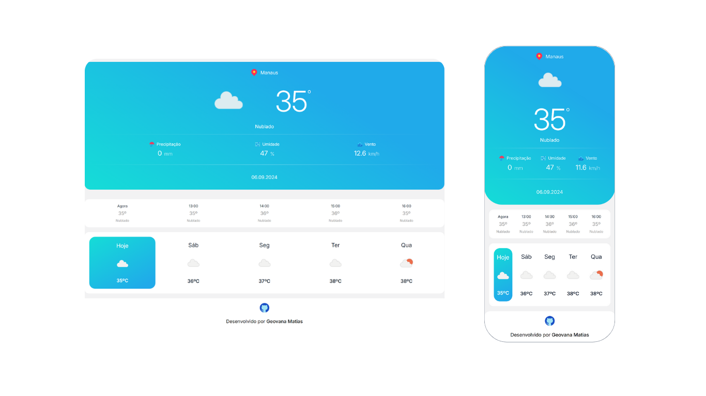

<h1>Blue Weather</h1>

<image src="https://img.icons8.com/?size=100&id=bFKiKQU2zdSw&format=png&color=000000"/>

Web app de dados metereológicos de Manaus. Mostra dados em tempo real obtidos pela <a href="https://open-meteo.com/">Open-Meteo API
</a>.

## Tecnologias utilizadas
   

## Screenshots

